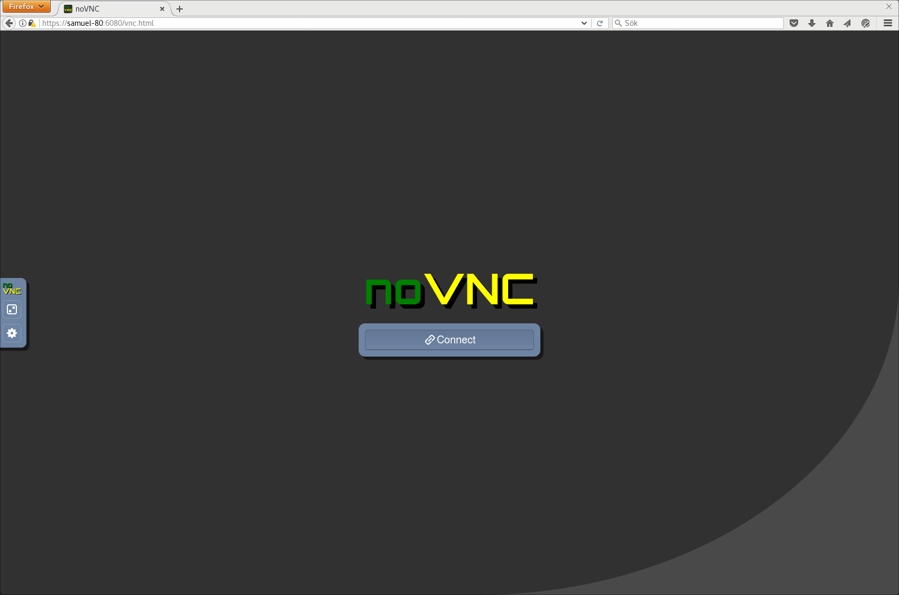

# docker-ubuntu-desktop
Ubuntu Desktop Web Browser Accessible Docker Image

## VNC SERVER


# HOW TO DO IT BY RAILWAY

**STEP 1**

> OPEN WEBSITE AND LOGIN
> CLICK DEPLOY BUTTON
> SELECT GITHUB CONFIGURATION
> PASTE THIS PROJECT URL
> 
> ```https://github.com/ShadowCraftMC2026/VNC-UBUNTU-SERVER```
> CLICK DEPLOY AND WAIT THE CONFIGURATION

**STEP 2**

> COPY THE IPV4 AND
> OPEN BROWSER AND TYPE
> ```https://YOUR-VPS-IP-HERE:6080```
> AND ENTER WAIT TO OPEN THE VNC SERVER AND CLICK
> noVNC CONNECTION BUTTON
> AND ENJOY


# SUPPORT PTERODACTYL PANEL

Ubuntu	14.04	🔴 NO	
16.04	🔴 NO *	
18.04	🔴 NO *	
20.04	🔴 NO *	
22.04	✅ YES	8.3
24.04	✅ YES	8.3
26.04	✅ YES	8.3
Debian	8	🔴 NO *	
9	🔴 NO *	
10	✅ YES	8.3
11	✅ YES	8.3
12	✅ YES	8.3
13	✅ YES	8.3
CentOS	6	🔴 NO	
7	🔴 NO *	
8	🔴 NO *	
Rocky Linux	8	✅ YES	8.3
9	✅ YES	8.3
AlmaLinux	8	✅ YES	8.3
9	✅ YES	8.3

## OR INSTALL VNC SERVER ON YOUR VPS

## Usage
```
$ docker run -it --platform=linux/amd64 -p 6080:6080 akarita/docker-ubuntu-desktop
```

## Access
```
http://localhost:6080/vnc.html
```

or

```
https://localhost:6080/vnc.html
```

## DockerHub

https://hub.docker.com/r/akarita/docker-ubuntu-desktop

## Docker Pull
```
$ docker pull akarita/docker-ubuntu-desktop
```

## Docker Build
```
$ docker build . -t docker-ubuntu-desktop
```

## License
MIT License (c) 2026 [ShadowCraftMC2026 PROJECT](https://github.com/ShadowCraftMC2026)
